# NLW Journey

Repositório do projeto NLW Journey da [Rocketseat](https://www.rocketseat.com.br/eventos/nlw/convite/everton-31759)

## Descrição

Este repositório contém um aplicativo mobile desenvolvido em React Native com um backend em Node.js. O aplicativo permite marcar viagens, criar atividades e salvar links importantes. Além disso, possui uma lista de convidados que recebem um link para confirmar sua presença na viagem através de deep link.

## Tecnologias Utilizadas

- **Frontend**: React Native
- **Backend**: Node.js

## Funcionalidades

- Marcação de viagens
- Criação e gerenciamento de atividades
- Salvamento de links importantes
- Lista de convidados com confirmação de presença via deep link

## Demonstração

### Frontend e Backend

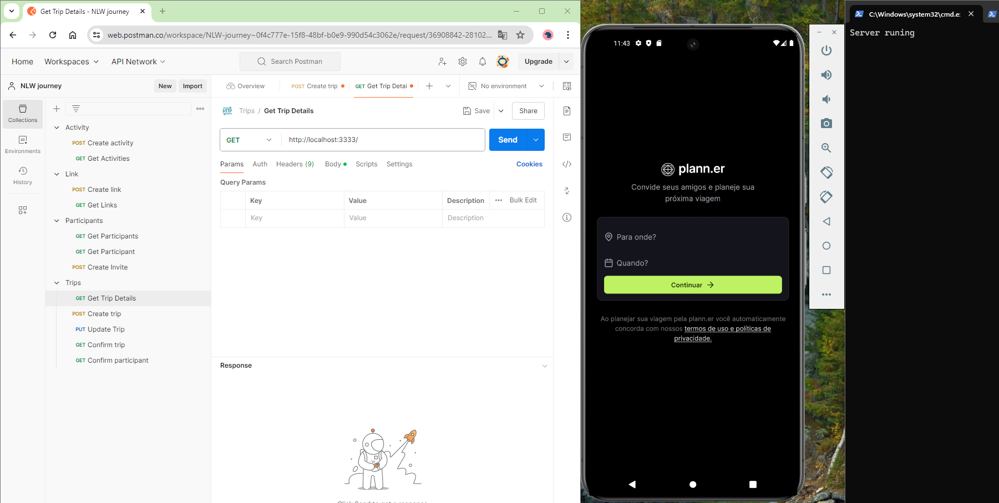

### Telas do Aplicativo

#### Home

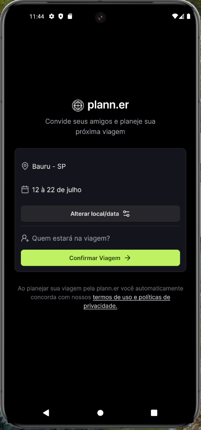
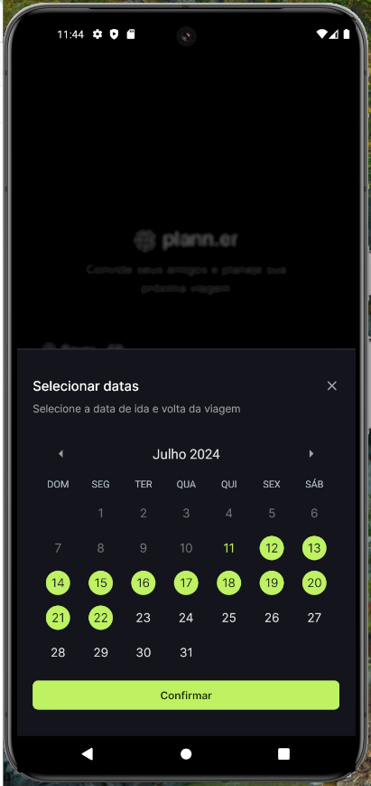
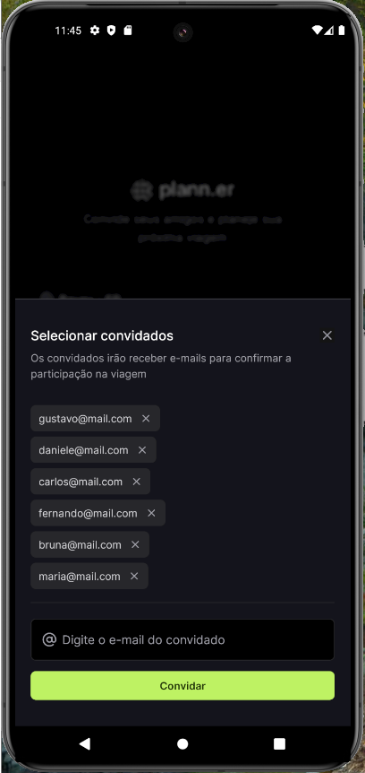
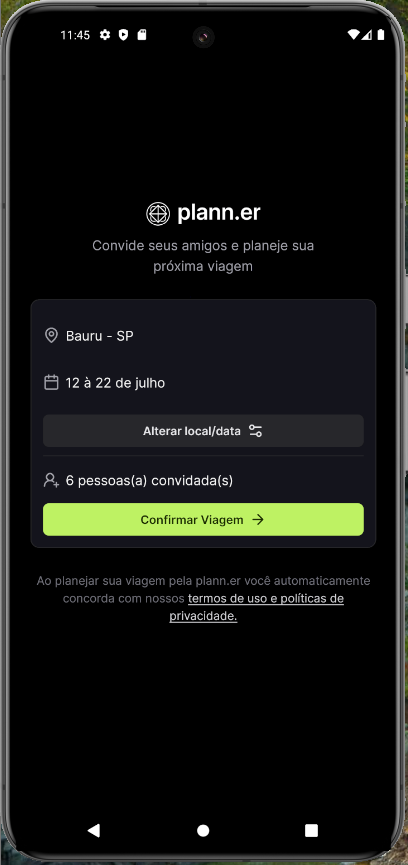

#### Detalhes da Viagem

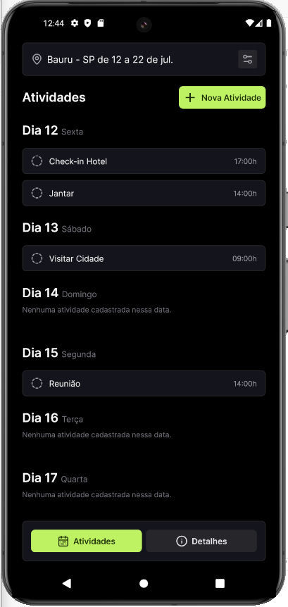
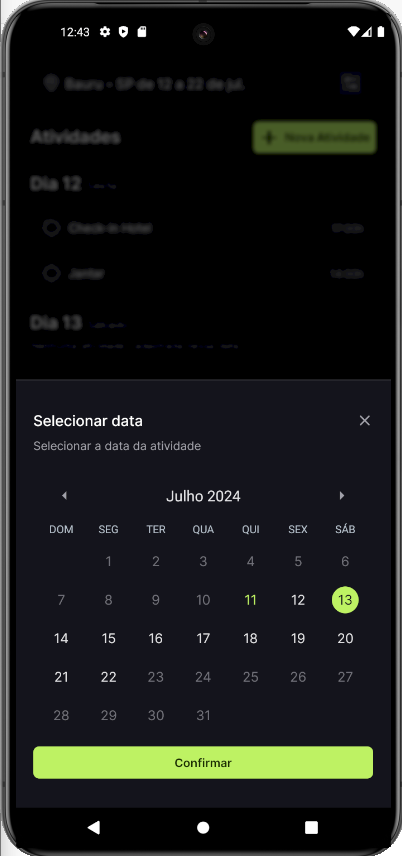
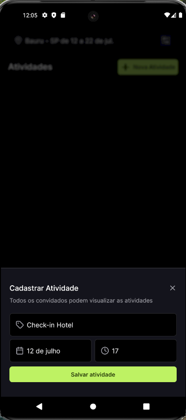
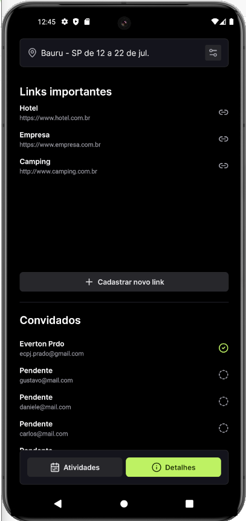

#### Links da Viagem

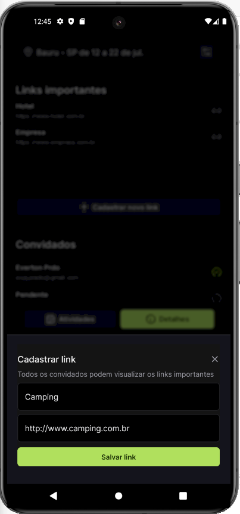

#### Confirmação via Deep Link

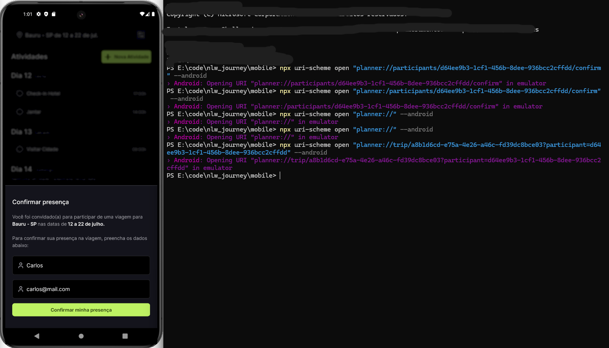

#### Remover Viagem

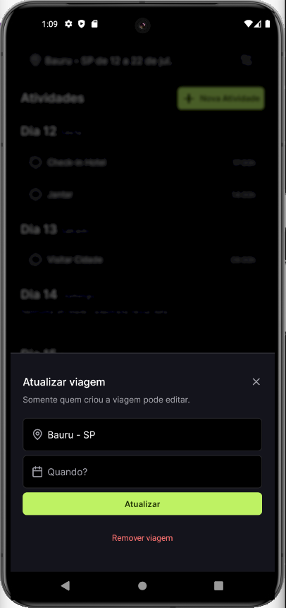